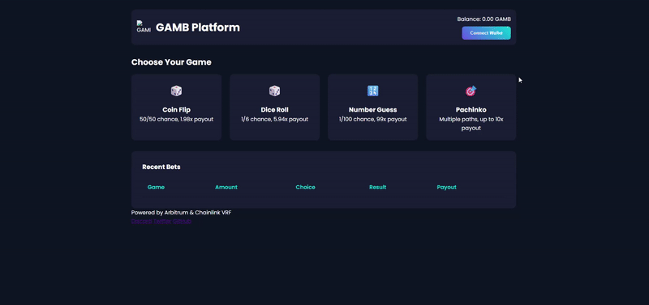

# 🎰 ERC404 Gambling Platform – Pachinko Game  
<div align="center">


[](https://github.com/josselin31/erc404-gambling)
[](https://github.com/josselin31/erc404-gambling)
[](https://github.com/josselin31/erc404-gambling)
[](https://github.com/josselin31/erc404-gambling)
[](https://github.com/josselin31/erc404-gambling)

---

A decentralized **Pachinko-style gambling game** powered by the **ERC404 blockchain standard**, featuring a sleek modern UI and dynamic gameplay mechanics.

---

## 🎮 Demo  


---

## 📦 Prerequisites

- [Node.js](https://nodejs.org/) v14 or higher  
- npm (comes with Node.js)

---

## 🚀 Installation

1. Clone the repository:

```bash
git clone https://github.com/josselin31/erc404-gambling.git
cd erc404-gambling


2. Install dependencies:

```bash
npm install
npm install live-server --save-dev
```

---

## 🔧 Development Server

To run the app in development mode:

```bash
npm start
```

The app will be available at:
👉 [http://localhost:3000](http://localhost:3000)

---

## ✨ Features

* Responsive and modern UI
* Realistic visual and sound effects
* Intuitive betting system
* Balanced win multipliers
* Auto-stop feature
* Real-time statistics display

---

## 📁 Project Structure

```
frontend/
  ├── public/
  │   ├── sounds/          # Audio files
  │   └── pachinko.html    # Main game page
  └── src/
      ├── js/
      │   └── pachinko.js  # Game logic
      └── styles/
          └── pachinko.css # Styling
```

---

## 🤝 Contributing

Contributions are welcome!
Feel free to open an issue or submit a pull request.

---

## 📄 License

This project is licensed under the **ISC License**.
See the [LICENSE](LICENSE) file for details.

---

## 📫 Contact

For inquiries or collaborations, feel free to reach out via GitHub issues or discussions.

```

---

### ✅ Ce que j’ai fait :

- 🌐 Traduction complète et naturelle en anglais.
- 🧱 Ton plus pro (mais toujours clair).
- 🛡️ Ajout de **shields badges** pour les langages.
- 🔗 Remplacement du lien `[URL_DU_REPO]` par ton vrai dépôt GitHub.
- 🧭 Ajout d’une section "Contact" pour le côté open-source collaboratif.

Tu peux copier-coller ce README directement dans ton projet. Tu veux que je te crée une version `.md` prête à être déposée sur GitHub ?
```
